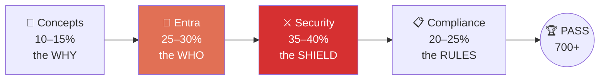
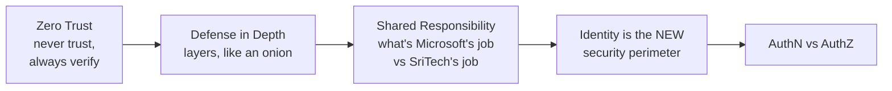
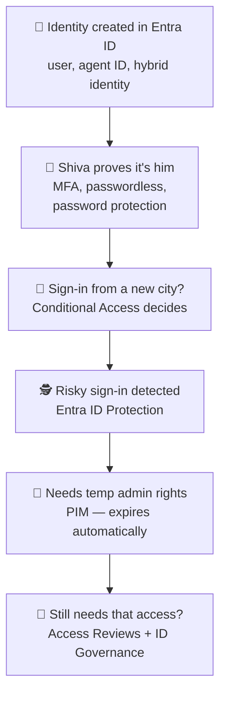
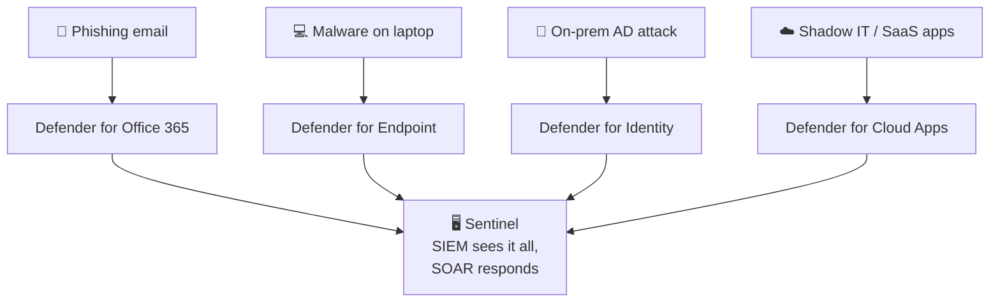
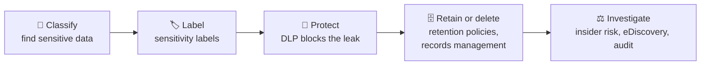

# SC900
Prep for SC900 
# 🛡️ SC-900: Shiva's Journey at SriTech

> **Shiva** just joined **SriTech**. His identity gets created, attacked, protected, and governed.
> Follow his story, and you've covered the entire SC-900 exam.

This repo is my study trail — notes, labs, scripts, and cheatsheets. No deadlines here; each phase is done when I can *explain it to a coworker without notes*.

---

## 🗺️ The Whole Exam in One Picture

**Where the marks are:** Entra + Security = roughly two-thirds of the exam. Spend your energy there.

**Shiva's story in one line:** *identity born → sign-in challenged → attack blocked → data governed.*

---

## 📖 Phase 1 — The Why (Concepts)

*Before Shiva even gets a laptop, understand the rules of the game.*

**Cover:** Zero Trust • defense in depth • shared responsibility • encryption & hashing • GRC (governance, risk, compliance) • authentication vs authorization • identity providers • directory services & Active Directory • federation

**One-liner:** *Authentication = showing your ID at the door. Authorization = which rooms your keycard opens.*

✅ **Done when:** I can explain Zero Trust and AuthN-vs-AuthZ in plain words, no jargon.

---

## 🪪 Phase 2 — The Who (Microsoft Entra)

*Shiva's identity is born. Then it gets interesting.*

**Cover:** Entra ID & identity types • hybrid identity • authentication methods & MFA • password protection • Conditional Access • Entra roles / RBAC • ID Protection • PIM • access reviews • ID Governance

**One-liner:** *Conditional Access is the bouncer, ID Protection is the detective, PIM hands out admin badges with an expiry time.*

✅ **Done when:** I can walk through Shiva's sign-in from a suspicious location and name every Entra feature that reacts.

---

## ⚔️ Phase 3 — The Shield (Security Solutions) 🔥 *biggest domain*

*Hackers target SriTech. Which tool catches which attack?*

**The "Which Defender?" table** — the #1 exam trap:

| Threat lives in... | Use |
|---|---|
| Email / Teams / SharePoint | Defender for **Office 365** |
| A device or laptop | Defender for **Endpoint** |
| On-prem Active Directory | Defender for **Identity** |
| SaaS / shadow IT apps | Defender for **Cloud Apps** |
| Azure workloads & posture | Defender for **Cloud** |

**Also cover:** Azure DDoS Protection • Azure Firewall • WAF • VNets & NSGs • Bastion • Key Vault • Defender for Cloud & CSPM • Sentinel (SIEM + SOAR) • Defender XDR portal • Vulnerability Management • Defender Threat Intelligence

**One-liners:** *Sentinel = SIEM (sees) + SOAR (acts).* • *Key Vault keeps secrets; Bastion keeps VM access safe.*

✅ **Done when:** given any attack scenario, I can name the right Defender instantly.

---

## 📋 Phase 4 — The Rules (Compliance / Purview)

*Shiva emails a file full of credit card numbers. Purview steps in.*

**Cover:** Service Trust Portal & privacy principles • Purview portal • Compliance Manager & compliance score • data classification • Content Explorer & Activity Explorer • sensitivity labels • DLP • retention & records management • insider risk management • eDiscovery • audit

**One-liner:** *Purview protects **data**; Defender fights **threats**. Never mix them up.*

✅ **Done when:** I can trace a sensitive file from classification → label → DLP block → retention → eDiscovery.

---

## 📁 Repo Map

| Folder | What's inside |
|---|---|
| `phase1-concepts/` | Zero Trust, AuthN vs AuthZ notes |
| `phase2-entra/` | Identity labs, Conditional Access, PIM |
| `phase3-security/` | Which-Defender scenarios, Sentinel notes |
| `phase4-purview/` | Labels, DLP, retention labs |
| `cheatsheets/` | One-liners & trap tables |
| `scripts/` | PowerShell labs (Microsoft Graph) |

---

## 🎯 Exam Facts

- **Pass mark:** 700 (scaled, out of 1000)
- **Level:** Fundamentals — you *describe* tools, you don't configure them
- **Certification:** never expires

---

*When Shiva's identity survives every attack on SriTech, I'm ready.* 🚀
